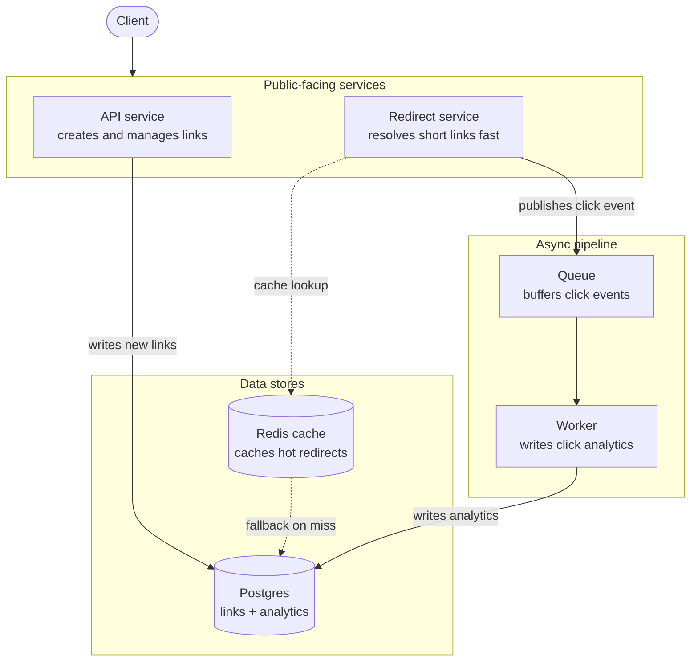

# App spec: link shortener with async click analytics

**Purpose of this document:** This describes the application that the [Cloud Infrastructure Portfolio Project Plan](./cloud-infra-portfolio-project-plan.md) is built around. Weeks 1–2 of that plan ("stand up a working EKS cluster") are not infrastructure for infrastructure's sake — every provisioning decision in those weeks (VPC layout, IAM roles, node sizing, security groups) exists because this specific app needs it. This document is the "why" that the infrastructure weeks refer back to. It is written to be self-contained context — a reader (human or AI) should be able to pick this file up on its own and understand what the app does, how its services relate, and which infrastructure requirements each one drives.

---

## 1. What the app is

A link shortener: a user submits a long URL and receives a short one (e.g. `short.ly/aB3xQ`). Visiting the short link redirects to the original URL. Functionally simple, like Bitly or TinyURL — but it splits naturally into workloads with very different performance and scaling characteristics, which is what makes it a good vehicle for a Kubernetes and observability-focused portfolio project rather than a generic CRUD app.

The two request paths matter more than the individual services:

- **Write path — creating a link.** Low volume, not latency-sensitive. A boring CRUD path, and it's meant to stay boring.
- **Read path — following a link.** High volume, latency-sensitive. This is where the interesting infrastructure work lives: caching, autoscaling, and asynchronous processing.

The core architectural decision in this app is that **the redirect path never blocks on analytics.** Recording that a click happened is decoupled from serving the redirect, via a queue. This single decision is what creates almost all of the infrastructure requirements below — it's the reason the app needs a queue, a worker pool, IAM scoping, and queue-depth-based autoscaling in the first place.

---

## 2. Services

### 2.1 API service
- **Responsibility:** creates and manages short links (write path).
- **Traffic profile:** low volume, tolerant of moderate latency.
- **Writes to:** Postgres (the canonical link table).
- **Infra implication:** minimal scaling needs, standard CRUD-service IAM permissions (read/write to the links table only).

### 2.2 Redirect service
- **Responsibility:** resolves a short code and issues an HTTP redirect (read path).
- **Traffic profile:** high volume, latency-sensitive. This is the public "hot path" of the app.
- **Reads from:** Redis cache first; falls back to Postgres on a cache miss.
- **Writes to:** nothing synchronously — instead, publishes a "click happened" event to the queue and returns the redirect immediately, without waiting for that event to be processed.
- **Infra implication:** this service is the justification for a cache layer, for horizontal autoscaling on request rate, and for a public/private subnet split (public-facing, but its dependencies — Redis, Postgres — should not be publicly reachable).

### 2.3 Worker
- **Responsibility:** consumes click events off the queue asynchronously and writes them into the analytics table.
- **Traffic profile:** bursty, decoupled from live user traffic — a backlog here does not affect users.
- **Reads from:** the queue.
- **Writes to:** Postgres (analytics table).
- **Infra implication:** this is the piece that justifies queue-depth-based autoscaling rather than pure CPU-based autoscaling, and the clearest example of least-privilege IAM in the whole app (the worker needs queue-consume and analytics-table-write permissions — nothing else).

### 2.4 Data stores
- **Postgres:** canonical store for both the links table (written by the API service) and the analytics table (written by the worker). Single datastore, two tables, two very different write patterns.
- **Redis:** cache in front of Postgres, read by the redirect service only. Not part of the canonical data — safe to lose and rebuild from Postgres.

### 2.5 Queue
- Buffers click events between the redirect service (producer) and the worker (consumer). This is the component that makes the read path's "never block on analytics" decision real, and it's the component whose depth becomes one of the most important metrics in the whole observability stack (see Section 5).

---

## 3. Architecture diagram

**Reading this diagram:** solid arrows are synchronous, blocking calls in the request path. Dashed arrows are the cache lookup and its fallback. The redirect service's arrow to the queue is fire-and-forget — it does not wait for the worker to process anything before returning a response to the client.

---

## 4. Why this app (and not a generic CRUD app)

A generic "frontend + API + database" app doesn't create much of a story for scaling, custom metrics, or interesting failure modes — it just sits there. This app was chosen specifically because each infrastructure decision in the portfolio project has a real justification traceable back to it:

| Infra element | Why it's needed | Which service drives it |
|---|---|---|
| VPC public/private subnet split | Redirect and API services are public-facing; Postgres, Redis, and the queue should not be | Redirect service, API service |
| Horizontal Pod Autoscaler on request rate | Redirect path is latency-sensitive and high-volume | Redirect service |
| Cache layer (Redis) | Avoid hitting Postgres on every redirect | Redirect service |
| Queue-depth-based autoscaling | Worker load is decoupled from live traffic; CPU alone doesn't reflect backlog | Worker |
| Scoped IAM roles (least privilege) | Worker only needs queue-consume + analytics-write; API only needs links-table read/write | Worker, API service |
| Custom application metrics (not just node/pod defaults) | Redirect latency, cache hit ratio, queue depth, worker lag are all real signals a platform team would track | All three services |
| A genuine, non-contrived chaos scenario | Killing Redis spikes redirect latency (but doesn't break correctness); stopping the worker grows the queue (but doesn't break redirects) | Redirect service + Redis; Worker + Queue |

---

## 5. What this means for later weeks of the project

This spec is referenced by, and should be read alongside, the main [Cloud Infrastructure Portfolio Project Plan](./cloud-infra-portfolio-project-plan.md). Specifically:

- **Weeks 1–2 (IaC/EKS):** the VPC and subnet design should reflect the public/private split described in Section 4 — not a flat, undifferentiated network. IAM roles provisioned here should already anticipate the least-privilege split between the API service and the worker (Section 2.2, 2.3).
- **Weeks 3–4 (deploy the app):** resource requests/limits and HPA configuration should be informed by the different traffic profiles in Section 2 — the redirect service and worker are not sized or scaled the same way.
- **Weeks 7–9 (observability):** the custom metrics to instrument are largely already specified in Section 4's table — redirect latency, cache hit ratio, queue depth, and worker processing lag. Dashboards should surface these, not just generic node/pod CPU and memory.
- **Weeks 10–11 (chaos):** the two failure scenarios in Section 4's last row (kill Redis; stop the worker) are the two chaos experiments this app was chosen to support. Both are meaningful precisely because they degrade gracefully rather than causing outright failure — which is what makes them worth diagnosing with dashboards rather than just noticing the app is down.

---

## 6. Explicitly out of scope

To keep the project achievable in ~72 hours, the following are deliberately not part of this app's scope:

- User authentication / accounts for link creators
- Custom domains or link expiry policies
- A frontend UI (a CLI or simple API-only interface is sufficient — the point of the project is the infrastructure, not the product)
- Multi-region deployment (single-region is sufficient to demonstrate the concepts in this project)